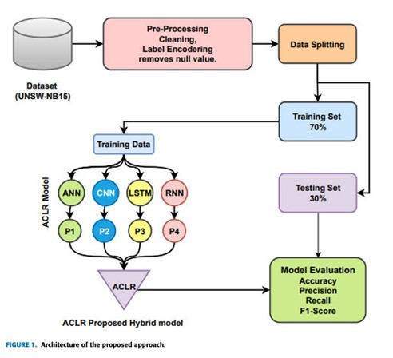

<div align="center">

# 🛡️ Botnet Attack Detection using Explainable AI (XAI)

### XAI-Based Stacked Attention Deep Learning Framework for IoT Botnet Attack Detection

[](https://www.python.org/)
[](https://www.tensorflow.org/)
[](https://keras.io/)
[](https://flask.palletsprojects.com/)
[](https://scikit-learn.org/)
[](#-license)

<br/>

*An M.Tech (Computer Science & Engineering) thesis project that detects IoT botnet attacks using Deep Learning, explained through LIME, SHAP, and Integrated Gradients.*

</div>

---

## 📑 Table of Contents

- [📖 Overview](#-overview)
- [🎯 Objectives](#-objectives)
- [✨ Key Features](#-key-features)
- [🏗️ System Architecture](#️-system-architecture)
- [📊 Dataset](#-dataset)
- [🧠 Deep Learning Models](#-deep-learning-models)
- [🔍 Explainable AI (XAI)](#-explainable-ai-xai)
- [🌐 Flask Web Application](#-flask-web-application)
- [📈 Performance](#-performance)
- [📂 Project Structure](#-project-structure)
- [⚙️ Tech Stack](#️-tech-stack)
- [🚀 Installation & Setup](#-installation--setup)
- [▶️ How to Run](#️-how-to-run)
- [📚 Documentation](#-documentation)
- [🎤 Presentation](#-presentation)
- [📄 References](#-references)
- [🔮 Future Work](#-future-work)
- [👨‍💻 Author](#-author)
- [📜 License](#-license)

---

## 📖 Overview

The rapid growth of the **Internet of Things (IoT)** has significantly increased the risk of **botnet attacks**. Traditional machine learning models often achieve high detection accuracy but behave as **"black boxes"**, offering little insight into *why* a decision was made.

This project proposes an **XAI-Based Stacked Attention Deep Learning Framework** that:

- 🎯 Detects botnet attacks in IoT network traffic with high accuracy
- 🧩 Explains every prediction using state-of-the-art XAI techniques
- 🌐 Ships as an easy-to-use Flask web application
- 📊 Visualizes feature importance for transparent, trustworthy predictions

---

## 🎯 Objectives

| # | Objective |
|---|-----------|
| 1 | Detect malicious botnet traffic in IoT environments |
| 2 | Compare multiple Deep Learning architectures (ANN, CNN, LSTM) |
| 3 | Improve detection accuracy using a Stacked Attention model |
| 4 | Generate interpretable predictions using Explainable AI |
| 5 | Deploy the trained model as a functional Flask web app |

---

## ✨ Key Features

- ✅ IoT Botnet Detection on the **UNSW-NB15** dataset
- ✅ ANN, CNN, LSTM, and **Stacked Attention** deep learning models
- ✅ Explainability via **LIME**, **SHAP**, and **Integrated Gradients**
- ✅ Full-stack **Flask** web application
- ✅ User registration & login system
- ✅ Dataset upload and real-time prediction
- ✅ Pre-trained, ready-to-use model weights
- ✅ Complete M.Tech thesis and presentation included

---

## 🏗️ System Architecture

<div align="center">

</div>

---

## 📊 Dataset

The framework is trained and evaluated on the **UNSW-NB15** dataset, a widely-used benchmark for network intrusion and botnet detection research.

**Workflow:** Data Cleaning → Label Encoding → Feature Scaling → Train-Test Split → Model Training → Prediction → Explainability

<div align="center">

</div>

---

## 🧠 Deep Learning Models

The project implements and benchmarks the following architectures:

- 🔹 **Artificial Neural Network (ANN)**
- 🔹 **Convolutional Neural Network (CNN)**
- 🔹 **Long Short-Term Memory (LSTM)**
- 🔹 **Stacked Attention Deep Learning Model** *(proposed)*

---

## 🔍 Explainable AI (XAI)

Predictions are made transparent using three complementary explainability techniques:

<table>
<tr>
<td align="center" width="33%">

**LIME**
<br/>
<br/>
<sub>Local Interpretable Model-Agnostic Explanations</sub>
</td>
<td align="center" width="33%">

**SHAP**
<br/>
<br/>
<sub>SHapley Additive exPlanations</sub>
</td>
<td align="center" width="33%">

**Integrated Gradients**
<br/>
<br/>
<sub>Attribution via path-integrated gradients</sub>
</td>
</tr>
</table>

---

## 🌐 Flask Web Application

<table>
<tr>
<td align="center" width="33%">

**🏠 Home Page**
<br/>

</td>
<td align="center" width="33%">

**📝 Registration**
<br/>

</td>
<td align="center" width="33%">

**🔮 Prediction**
<br/>

</td>
</tr>
</table>

**Application capabilities:**

- 👤 User Registration & Login
- 📁 Dataset Upload
- 🤖 Botnet Prediction
- 📊 XAI Visualization
- 📋 Result Display

---

## 📈 Performance

<div align="center">

</div>

The **Stacked Attention model** consistently outperforms baseline ANN, CNN, and LSTM models in detection accuracy while remaining fully explainable.

---

## 📂 Project Structure

```text
BOTNET-ATTACK-DETECTION-USING-XAI/
│
├── Dataset/                  # Training & testing datasets
├── Images/                   # README & documentation images
├── model/                    # Trained deep learning models
├── references/                # Research papers & citations
├── static/                    # Flask static assets (CSS/JS)
├── templates/                  # Flask HTML templates
│
├── attention.py                 # Stacked Attention model implementation
├── BotnetDetection.ipynb          # Main experimentation notebook
├── BotnetDetection.html            # HTML export of notebook
├── database.txt                     # Application database file
├── requirements.txt                  # Python dependencies
├── Final_Thesis_Main.pdf              # Complete M.Tech thesis
├── Ammaar_ppt.pptx                     # Project presentation
└── README.md                            # You are here
```

---

## ⚙️ Tech Stack

<div align="center">


</div>

---

## 🚀 Installation & Setup

**1. Clone the repository**

```bash
git clone https://github.com/YOUR_USERNAME/BOTNET-ATTACK-DETECTION-USING-XAI.git
cd BOTNET-ATTACK-DETECTION-USING-XAI
```

**2. Create a virtual environment** *(recommended)*

```bash
python -m venv venv
source venv/bin/activate      # On Windows: venv\Scripts\activate
```

**3. Install dependencies**

```bash
pip install -r requirements.txt
```

---

## ▶️ How to Run

### 📓 Run the Notebook

Open and execute the experimentation notebook:

```bash
jupyter notebook BotnetDetection.ipynb
```

### 🌐 Run the Flask Web Application

```bash
python app.py
```

Then open your browser at:

```
http://127.0.0.1:5000/
```

---

## 📚 Documentation

| Resource | File |
|----------|------|
| 📖 Complete M.Tech Thesis | [`Final_Thesis_Main.pdf`](Final_Thesis_Main.pdf) |
| 📓 Notebook (HTML Export) | [`BotnetDetection.html`](BotnetDetection.html) |
| 🧩 Attention Model Source | [`attention.py`](attention.py) |

---

## 🎤 Presentation

The project's PowerPoint presentation is available at:

```
Ammaar_ppt.pptx
```

---

## 📄 References

All supporting research papers used for this dissertation are available in the [`references/`](references/) directory.

---

## 🔮 Future Work

- ⚡ Real-time deployment on live IoT network traffic
- 🤖 Transformer-based detection architectures
- 🌍 Federated learning for privacy-preserving training
- ☁️ Cloud-native integration (AWS / Azure / GCP)
- 📱 Edge AI optimization for resource-constrained devices

---

## 👨‍💻 Author

<div align="center">

### Muhammad Ammaar Quadri

[](https://git.io/typing-svg)

[](https://github.com/ammaarquadri)
[](https://linkedin.com/in/ammaarquadri)
[](https://ammaar-quadri-123.vercel.app/)

</div>

---

## ⭐ Acknowledgements

This work was developed as part of an M.Tech dissertation focusing on **Explainable Artificial Intelligence for Botnet Attack Detection**. Special thanks to the research community whose datasets and publications made this project possible.

---

## 📜 License

This repository is intended strictly for **academic and educational purposes**.

---

<div align="center">


<br/><br/>

⭐ **If you found this project useful, consider giving it a star!** ⭐

</div>
